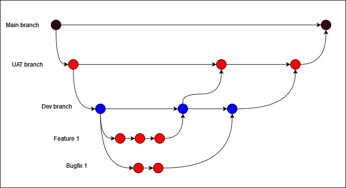

# eCommerce Practice Project Branch Strategy

## Environments

Currently we have the following environments: 

- Dev - Used by developers to develop new code or to fix exsisting code
- SYSTEST - Used by testers to test the developed code
- UAT - Used by the client to carry out user acceptence testing
- Prod - The live environment

## Branches

Within the eCommerce Practice Project Repository, there are three branches: 

### Main

The `main` branch will contain stable code which can be deployed to users at any time. No development work is to be done in this branch.

This branch will be deployed to the production environment.

### UAT

The `UAT` branch will be usually ahead of the `main` branch as it will contain the `feature / bugfix / hotfix` branches. This branch will be used for QAs and UAT testers to test out the code before it is merged with the `main` branch.

Once the `UAT` branch code have passed testing (unit testing, QA and UAT testing), it will only then be allowed to be merged into the `main` branch.

This branch will be deployed to the UAT environment.

### Dev

The `dev` branch will contain the latest code. Developers will not be directly working on the `dev` branch, but they will create a `Feature / bugfix / hotfix` branch from `main` where they will then merge to `dev`. 

This branch will be deployed to the Dev and SYSTEST environments.

## Feature/bugfix/hotfix

When creating the `Feature / bugfix / hotfix` branch, it should be a copy of the `main` branch. Every Feature / bugfix / hotfix should take place in a dedicated branch instead of the `dev` or `uat` branch. 
Only code that have passed unit testing from the `Feature / bugfix / hotfix` branches will then be allowed to be merged into the `dev` or `UAT` branches.
